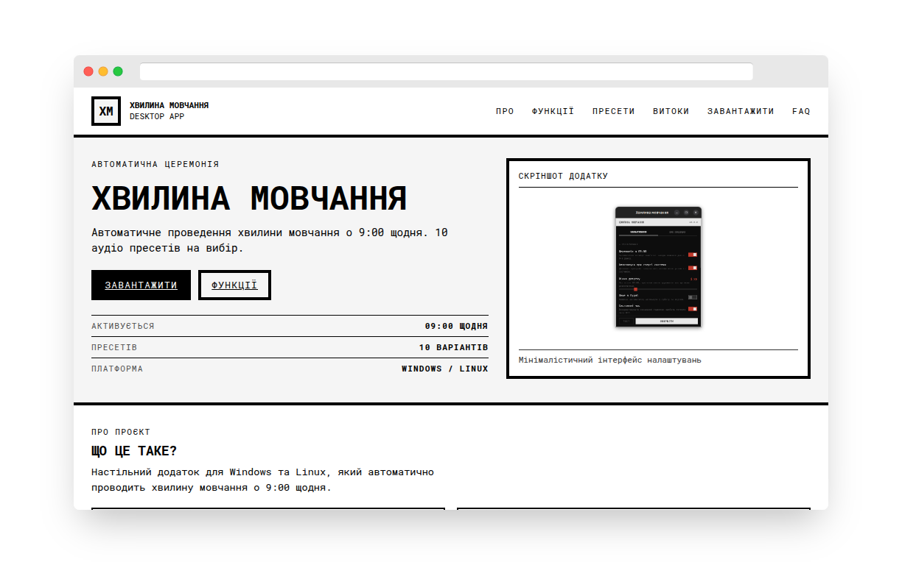

# Minute of Silence Site

[](https://github.com/ChernegaSergiy/minute-of-silence-site/actions/workflows/deploy.yml)
[](LICENSE)

A brutalist landing page for the Minute of Silence desktop app built with [Concrete CSS](https://github.com/medcore-ua/concrete-css) framework.

## Features

- **Brutalist Design**: Minimalist black and white interface with bold typography, built using the Concrete CSS framework following brutalist design principles.
- **Hero Section**: Prominently displays countdown timer to next ceremony at 9:00 AM along with key information about the application.
- **10 Audio Presets**: Visual showcase of all available ceremony preset options with their descriptions.
- **Download Section**: Convenient download links pointing directly to GitHub releases page.
- **FAQ Accordion**: Expandable accordion with answers to frequently asked questions about the application.
- **Responsive Layout**: Fully responsive design that adapts seamlessly to both desktop and mobile screen sizes.

## Technologies Used

- **Svelte 5**: Reactive UI framework
- **Vite**: Build tool and dev server
- **Concrete CSS**: Brutalist CSS framework developed by MedCore UA team

## Getting started



To get a local copy up and running, follow these simple steps:

1. Clone the repository:
   ```bash
   git clone https://github.com/ChernegaSergiy/minute-of-silence-site.git
   ```
2. Install dependencies:
   ```bash
   npm install
   ```
3. Start the development server:
   ```bash
   npm run dev
   ```
4. Navigate to [http://localhost:5173](http://localhost:5173) in your browser.

## Deployment

Automatically deployed to GitHub Pages via GitHub Actions workflow on every push to the main branch.

## Contributing

Contributions are welcome and appreciated! Here's how you can contribute:

1. Fork the project
2. Create your feature branch (`git checkout -b feature/AmazingFeature`)
3. Commit your changes (`git commit -m 'Add some AmazingFeature'`)
4. Push to the branch (`git push origin feature/AmazingFeature`)
5. Open a Pull Request

Please make sure to update tests as appropriate and adhere to the existing coding style.

## License

This project is licensed under the CSSM Unlimited License v2.0 (CSSM-ULv2). See the [LICENSE](LICENSE) file for details.
